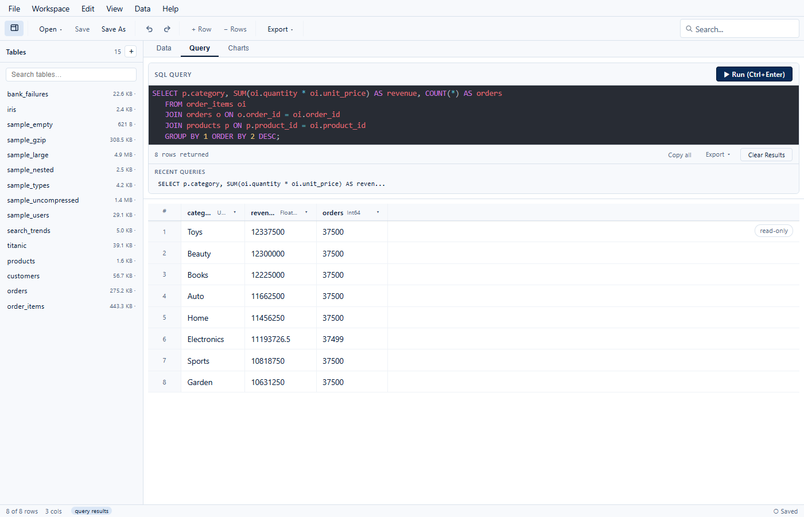

<div align="center">


# ParaSQL

**The SQL workbench for Parquet files.**
Query, explore, edit, and ship data from any folder of Parquet — with the power of DuckDB
and the feel of a spreadsheet.

[](https://github.com/harrisrauf/ParaSQL/actions/workflows/ci.yml)


[Quick start](#quick-start) · [Features](#features) · [Performance](#performance) · [Technical specifications](#technical-specifications) · [Roadmap](#roadmap) · [Contributing](CONTRIBUTING.md)

</div>

---



## Why ParaSQL exists

I started building ParaSQL while I was learning — I was creating my own
embeddings model for a larger product I had in mind.

A surprising amount of that work wasn't modelling at all: it was sorting through,
cleaning, and modifying a lot of Parquet data. Every tool I tried made it harder
than it had to be. Viewers opened one file and nothing else. CLIs needed a script
for every small change. BI platforms wanted a server, and cloud services wanted
my data. I just wanted to open my files, look at them, fix them, and query across
them.

So I started building the tool I needed. ParaSQL began as a single-file Parquet
editor and grew into something bigger: a multi-file analysis and database
management tool built on Parquet. It's free, open source, and runs entirely on
your machine.

> I didn't just want a Parquet viewer — I wanted the Excel + Postgres of Parquet
> files: a complete local data workbench.

## Features

### 🧮 A real SQL workbench, not a filter box
- Full **DuckDB** engine — CTEs, window functions, `UNNEST`, `PIVOT`-style
  aggregates, quoted identifiers, and everything else you expect from modern SQL.
- **Join across files.** Every table in your workspace is one `SELECT` away:
  `SELECT * FROM orders o JOIN customers c ON o.customer_id = c.customer_id`.
- Autocomplete over your real tables and columns, query history, and sensible
  guardrails: query results are read-only, capped, and destructive statements
  are rejected outside the editor.

### 📊 A spreadsheet-grade grid
- **Virtualized to 500,000+ rows** — smooth scrolling regardless of file size.
- Sort, per-column filters, whole-table search, row selection, and
  TSV/JSON/`WHERE`-clause clipboard formats.
- **Inline editing** with type-aware editors, insert/delete rows, add/drop/rename
  columns — with **undo/redo** that round-trips exactly, including BLOBs,
  microsecond timestamps, arrays, structs, and maps.

### 🗂 Workspace mode — a database made of files
- **Add files or scan folders**: each Parquet file becomes a queryable table.
  Mixed schemas are unioned automatically.
- Workspaces save to a portable **`.parasql`** file with relative paths — commit
  it, share it, reopen it on another machine.
- Workspace tables are **query-only for now** — multi-file editing is on the
  roadmap. Single files open in the full editor with atomic Parquet saves.

### 🔁 Move data freely
- Export tables *and query results* to **Parquet, CSV, JSON, and Excel**.
- Parquet codecs: **SNAPPY, ZSTD, GZIP, LZ4, BROTLI**, uncompressed.
- Every write is **atomic** — a failed export never corrupts an existing file.

### ⚡ Native speed, tiny footprint
- Rust + Tauri 2 — no Electron, no JVM, no server. Installers around **10–15 MB**.
- Cold-starts in well under a second; queries stream from DuckDB as Arrow batches.

### 🔐 Private by design
- Your data never leaves your computer. No accounts, no telemetry, no network calls.
- Strict CSP, capability-scoped IPC, local-only file access.

**Coming soon:** charts & pivot tables from query results, dashboards &
notebooks, and AI-assisted dataset summaries — still local, still private.

## Performance

Real numbers from the bundled 500k-row benchmark file on Windows 11
(dev build, mid-range laptop — your mileage will vary):

| Operation | Result |
| --------- | ------ |
| Open a 500,000-row Parquet file (editable table) | ~8 s cold, instant after |
| Page 10,000 rows (keyset pagination) | ~150 ms first page, ~200 ms subsequent |
| Full-table search across 500,000 rows | ~0.7 s |
| Multi-file join (100k × 300k × 20k rows) | ~1 s per query |
| Export 500,000 rows to Parquet | seconds, atomic |

The grid never renders more than the visible window, and queries never
materialize more than you ask for.

## Who it's for

- **Data analysts** who live in spreadsheets but receive Parquet.
- **AI / ML engineers** who need to inspect, fix, and version training data
  without writing a notebook cell for every glance.
- **Data engineers** who want to sanity-check pipelines without spinning up a
  warehouse.
- **Anyone** with a folder full of Parquet files and no good way to look inside.

## How it compares

A rough comparison — every tool here is great at something; ParaSQL is the one
that does *all* of this in a single desktop app:

| | ParaSQL | DuckDB CLI | Parquet viewers | SQL IDEs | BI platforms |
| --- | :-: | :-: | :-: | :-: | :-: |
| GUI data grid w/ editing | ✅ single file | ❌ | ✅ (read-only) | ✅ | ❌ |
| SQL with cross-file joins | ✅ | ✅ | ❌ | ⚠️ varies | ✅ |
| Portable multi-file workspace | ✅ | ⚠️ scripts | ❌ | ❌ | ⚠️ server |
| Undo/redo for data edits | ✅ | ❌ | ❌ | ⚠️ | ❌ |
| Export Parquet/CSV/Excel/JSON | ✅ | ✅ | ⚠️ | ⚠️ | ⚠️ |
| Local-only, no server | ✅ | ✅ | ✅ | ✅ | ❌ |
| Free & open source | ✅ | ✅ | ✅ | ⚠️ | ⚠️ |

## Quick start

### Install

Grab the installer for your platform from the
[Releases](https://github.com/harrisrauf/ParaSQL/releases) page
(`.msi` / `.exe` for Windows, `.dmg` for macOS, `.AppImage` / `.deb` for Linux).

### Build from source

```bash
git clone https://github.com/harrisrauf/ParaSQL.git
cd ParaSQL
npm install
npm run tauri dev        # or: npm run tauri build
```

Prerequisites: Node 20+, stable Rust, and (on Windows) the WebView2 runtime
which ships with Windows 10/11.

### First five minutes

1. **Open a file** (`File → Open File…`) — or open the bundled demo workspace
   at `Sample_data/parasql-demo.parasql`.
2. **Query it.** Hit the Query tab and run:
   ```sql
   SELECT p.category, SUM(oi.quantity * oi.unit_price) AS revenue
   FROM order_items oi
   JOIN orders o    ON o.order_id = oi.order_id
   JOIN products p  ON p.product_id = oi.product_id
   GROUP BY 1
   ORDER BY 2 DESC;
   ```
3. **Edit it.** Open a single file (`File → Open File…`), double-click any cell,
   `Ctrl+Z` to undo, then `Ctrl+S` to save it back to Parquet.

## Usage highlights

**Workspace files are just JSON** — portable by design:

```jsonc
{
  "version": 1,
  "name": "sales",
  "tables": [
    { "name": "orders",  "path": "sales/orders.parquet",  "mode": "query" },
    { "name": "products","path": "sales/products.parquet","mode": "editable" }
  ]
}
```

**Keyboard shortcuts**

| Shortcut | Action |
| -------- | ------ |
| `Ctrl+Enter` | Run query |
| `Ctrl+Z` / `Ctrl+Y` | Undo / redo edits |
| `Ctrl+S` | Save file (or workspace) |
| `Ctrl+C` / `Ctrl+A` | Copy selection / select all |
| `F2` / `Enter` | Edit focused cell |
| `Tab` | Move across cells |
| `Shift+Click` | Extend selection |

## Technical specifications

### Architecture

```
┌────────────────────────────────────────────────────────────┐
│ Svelte 5 UI (runes) — grid, SQL editor, workspace shell     │
├────────────────────────────────────────────────────────────┤
│ Typed IPC wrappers  →  Tauri commands (async, sandboxed)    │
├────────────────────────────────────────────────────────────┤
│ Rust engine — DuckDB 1.5 (bundled), Arrow, atomic file I/O  │
├────────────────────────────────────────────────────────────┤
│ Parquet files on disk  ·  .parasql workspace (JSON)         │
└────────────────────────────────────────────────────────────┘
```

### Stack

| Layer | Technology |
| ----- | ---------- |
| Shell | [Tauri 2](https://tauri.app) (Rust) |
| Engine | [DuckDB 1.5](https://duckdb.org) (bundled), [Arrow](https://arrow.apache.org) |
| Frontend | [Svelte 5](https://svelte.dev) + TypeScript, CodeMirror 6, TanStack Virtual |
| Formats | Parquet (Snappy/Zstd/Gzip/LZ4/Brotli), CSV, JSON, XLSX |
| Tests | Rust unit tests, Playwright-over-CDP E2E (107 deep + 12 smoke checks) |
| CI | GitHub Actions — `svelte-check`, frontend build, `cargo test --lib` |

### Engineering notes

- **Keyset pagination** on a stable internal row id — no `OFFSET` drift on large
  tables.
- **Snapshot-based undo** for complex edits (rows, columns, nested types) with
  temp side tables, not lossy SQL literals.
- **Save-point tracking** so undo → redo back to a saved state reports clean.
- **Transactional editor swaps**: failed table mounts never leave the engine
  half-configured.
- **Reserved-name shielding** and identifier quoting everywhere — table and
  column names with spaces, dashes, or unicode are safe.
- **Poison-tolerant locking** and strict result caps keep the app responsive
  under errors.

## Roadmap

- **v0.3 — Charts & pivot:** build charts and pivot tables straight from query
  results (ECharts), save them in the workspace.
- **v0.4 — Dashboards & notebooks:** compose saved queries and charts into
  shareable dashboards; notebook-style analysis flow.
- **v0.5 — AI copilot:** natural-language-to-SQL and dataset summaries with a
  model you choose.
- Ongoing: more file formats, cross-platform polish, better large-file tooling.

Vote on what's next in [Discussions](https://github.com/harrisrauf/ParaSQL/discussions).

## FAQ

**Is it really free?**
Yes — MIT licensed, no limits, no paid tiers. Everything is free and open source.

**Does it upload my data?**
No. There is no network code, no telemetry, and no account system. Your files
are opened read/write directly from your disk.

**Parquet only?**
Parquet is the native format today (it is the best one). More sources are on
the roadmap.

**Can I edit files?**
Single files, yes — fully: inline editing, undo/redo, and atomic saves.
Workspace tables are query-only for now; multi-file editing is on the roadmap.

**Can it handle a 10 GB file?**
Querying yes — DuckDB streams Parquet efficiently. In-grid editing is guarded
by a size limit (2 GB by default) because edits materialize an in-memory table.

**Windows only?**
The stack is cross-platform; releases will cover macOS and Linux as the
roadmap progresses.

## Contributing

Contributions are welcome — see [CONTRIBUTING.md](CONTRIBUTING.md) for setup,
project layout, testing, and PR guidelines. Looking for a place to start? Check
the `good first issue` label.

If ParaSQL saves you an afternoon, **a ⭐ helps other analysts find it.**

## License

[MIT](LICENSE) © 2026 Harris Rauf

ParaSQL is an independent project and is not affiliated with DuckDB Labs or the
Tauri project.
